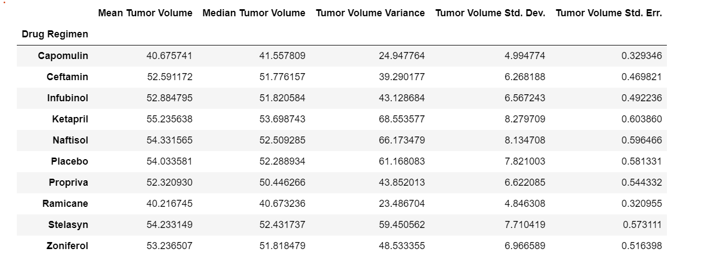
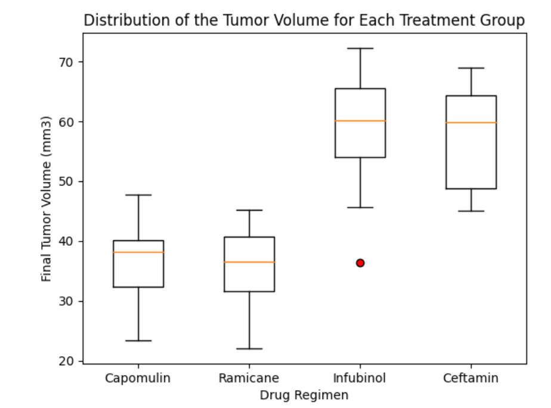
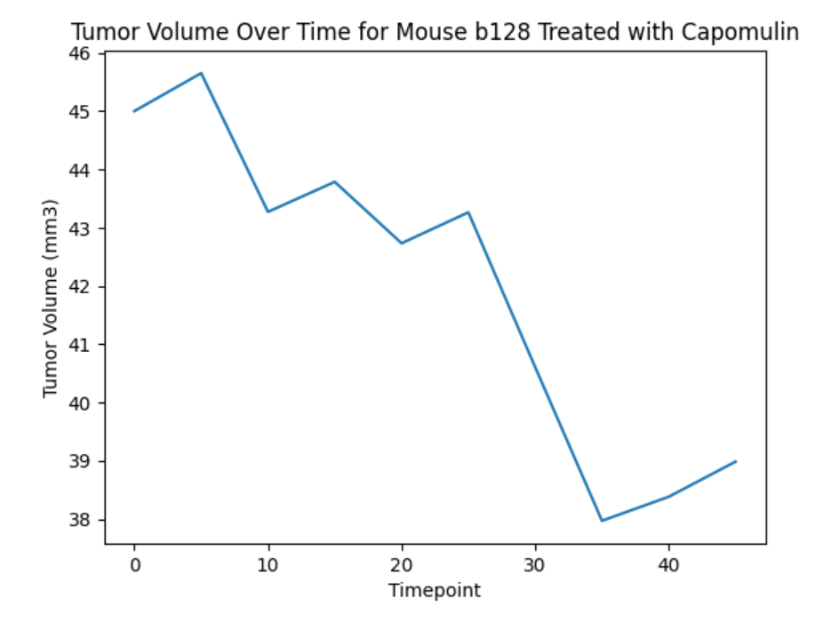
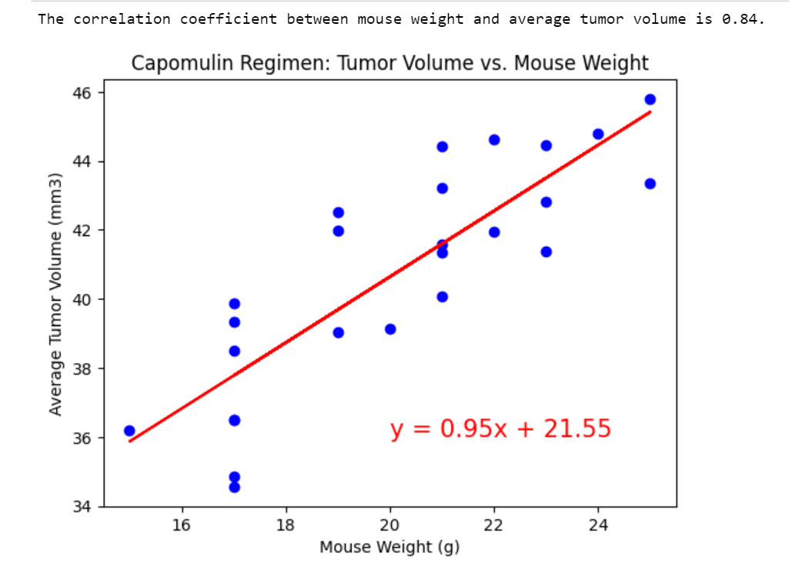

# Module 5 Challenge: Matplotlib Data Visualization
<ins>Project Overview</ins>
------

This purpose of this project is to generate tables and figures needed for the technical report of the clinical study where 249 mice who were identified with SCC tumors received treatment with a range of drug regimens. Over the course of 45 days, tumor development was observed and measured. The purpose of this study was to compare the performance of Pymaceuticals’ drug of interest, Capomulin, against the other treatment regimens

<ins>Processes and Technologies</ins>
------

In order to accurately compare Capomulin with the other drug regimen's, I first merged these dataframes together and deleted duplicate data to create a clean dataframe. After this, I used the `groupby()` function to calculate the mean, median, variance, standard deviation, and SEM of the tumor volume for each drug regimen (Table 1 below).

Next, I showed the total number of timepoints for all mice tested by drug regimen in a bar chart using both pandas and pyplot. I chose a pie chart to best show the distribution of male versus female mice using both pandas and pyplot. Then, I calculated the final tumor volume of each mouse across the four drug regimens chosen, Capomulin, Ramicane, Infubinol, and Ceftamin. I used this filtered data frame to calculate the IQR and outliers for each drug regimen. I used these values to create a box and whisker plot to show the distribution of the tumor volume for each treatment group.

Lastly, I created a line plot to show the tumor volume over time for a single mouse treated with Capomulin and calculated the correlation coefficient using a scatter plot to show the tumor volumne versus the mouse weight.

<ins>Challenges</ins>
------

I did not come across any major challenges during this project, but I worked with bootcamp members Kimberly Reitema and Saroja Shrestha. Overall, I was able to effectively showcase the study results using Matplotlib.
