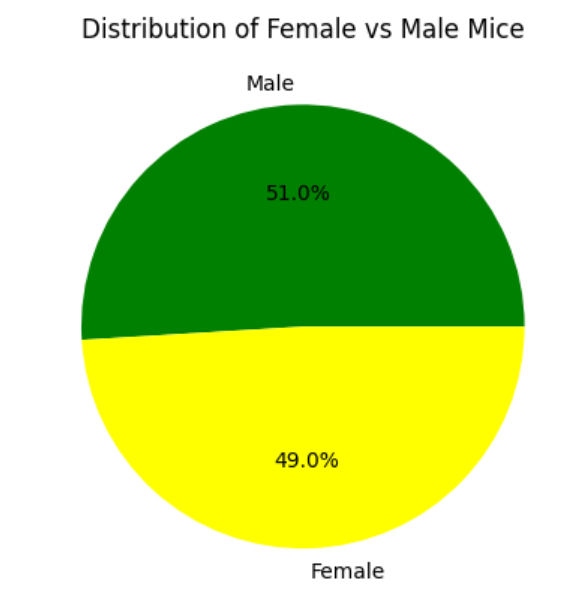

# matplotlib
In this challenge, I first started with mouse data and the study results in two different files. In order to accurately compare Capomulin with the other drug regimen's, I merged these dataframes together and deleted duplicate data to create a clean dataframe. After this, I used the groupby function to calculate the mean, median, variance, standard deviation, and SEM of the tumor volume for each drug regimen (Table 1 below).

Next, I showed the total number of timepoints for all mice tested by drug regimen in a bar chart using both pandas and pyplot.

Next, I used a pie chart to show the distribution of male versus female mice using both pandas and pyplot.

Then, I calculated the final tumor volume of each mouse across the four drug regimens chosen, Capomulin, Ramicane, Infubinol, and Ceftamin. I used this filtered data frame to calculate the IQR and outliers for each drug regimen. I used these values to create a box and whisker plot to show the distribution of the tumor volume for each treatment group.

Lastly, I created a line plot to show the tumor volume over time for a single mouse treated with Capomulin and calculated the correlation coefficient using a scatter plot to show the tumor volumne versus the mouse weight.

